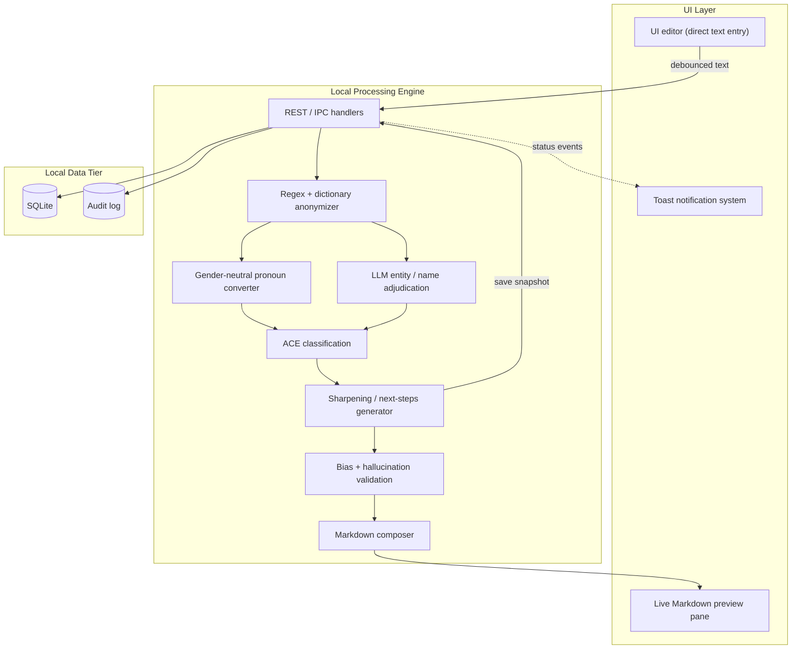

# ACE Eval Generator — Technical Specification (OpenSpec)

Integrated direct-entry workspace: **local-first**, **no file uploads**, **PII / light anonymization** via hybrid Regex + LLM, **ACE structuring**, **sharpening**, **toast UX**, **local persistence**, **audit**, **bias / hallucination checks**.

---

## Document control

| Field | Value |
|-------|--------|
| Product | ACE Eval Generator (Integrated Direct-Entry Workspace) |
| Status | Draft for implementation |
| Constraint | No file upload; direct text entry only |

---

## 1. Non-negotiable constraints

| Constraint | Requirement |
|------------|-------------|
| Input | Typed or pasted text only; no uploads, no clipboard image pipeline |
| Processing | Prefer on-device / local runtime; outbound calls only if policy allows and are disabled by default in **strict local** mode |
| Data residency | Persisted artifacts remain on localhost / corporate device; schema supports air-gapped deployment |
| HR alignment | Outputs are **drafts for human review**; no automated employment decisions |

---

## 2. Roadmap summary

### Phase 1: Native workspace (MVP)

- Direct-entry UI and real-time anonymization (hybrid Regex + LLM).
- Gendered pronouns → gender-neutral (They / Them / Theirs) via rules + constrained LLM fallback.
- ACE mapping with empty-bucket placeholder: **No specific observations provided.**

### Phase 2: Sharpening engine and UI feedback

- Actionability layer: vague praise → ≥3 grounded **Next Steps**.
- **Zero** use of `window.alert()` / `confirm()` for product flows; **toast** system for Processing, Anonymization Complete, Saved.
- Split-pane: Markdown preview updates as user types (debounced).

### Phase 3: Local persistence and audit

- Local DB (e.g. SQLite) for evaluation history; no data leaves local network in hardened builds.
- Audit trail: original raw vs final sharpened output + metadata hashes.
- Bias calibration: flags for failed neutralization + sharpening hallucination / unsupported additions.

---

## 3. Architecture

### 3.1 Stack options

- **Electron + embedded local API** — main process hosts SQLite + optional bundled LLM or IPC to a locked-down local inference service.
- **React SPA + lightweight local backend** — `localhost` REST (e.g. Fastify / Express) + SQLite for Phases 2–3; Phase 1 can be pure-client with migration path.

### 3.2 Processing pipeline

1. Input pane → debounced text stream  
2. Regex pre-pass → high-confidence patterns (optional org roster **local only**)  
3. Hybrid LLM pass → residual entities; map to **Evaluatee** (or configurable multi-person labels)  
4. Pronoun normalizer → deterministic rules + constrained LLM only where ambiguous  
5. ACE mapper → structured JSON + Markdown  
6. Sharpener (Phase 2) → next steps grounded in evidence  
7. Persistence and audit (Phase 3) → revisions + append-only audit events  

### 3.3 System diagram (Mermaid)



---

## 4. Local API schema

Base: `https://localhost:<port>/api/v1` (or Electron `ipc.invoke` with identical payloads).

**OpenSpec route index (internal):**

| Method | Path | Purpose |
|--------|------|--------|
| `POST` | `/process-text` | Run anonymization → ACE (+ optional sharpening) → return Markdown/JSON |
| `GET` | `/get-history` | Paginated list of saved evaluations |
| `POST` | `/save-eval` | Persist revision + audit hooks |

*Resolved URL examples:* `POST .../api/v1/process-text`, `GET .../api/v1/get-history`, `POST .../api/v1/save-eval`.

### 4.1 `POST /process-text`

**Purpose:** Anonymization → ACE → optional sharpening → validation; return structured result + Markdown. Persistence optional.

**Request**

```json
{
  "requestId": "uuid",
  "rawText": "string",
  "options": {
    "runSharpening": false,
    "strictLocal": true,
    "locale": "en-PH",
    "aceModelId": "string",
    "sharpenModelId": "string"
  }
}
```

**Response (200)**

```json
{
  "requestId": "uuid",
  "anonymizedText": "string",
  "replacements": [
    {
      "span": [12, 18],
      "originalClass": "PERSON_PROPER",
      "replacement": "Evaluatee",
      "method": "REGEX"
    }
  ],
  "ace": {
    "aptitude": { "summary": "string", "evidence": ["string"] },
    "character": { "summary": "string", "evidence": ["string"] },
    "effectiveness": { "summary": "string", "evidence": ["string"] }
  },
  "sharp": {
    "nextSteps": [
      {
        "text": "string",
        "groundedIn": ["evidence-quote-ref"]
      }
    ]
  },
  "validation": {
    "pronounNeutralizationOk": true,
    "hallucinationRiskScore": 0.0,
    "flags": []
  },
  "markdown": "string"
}
```

**Errors**

| Code | When |
|------|------|
| 400 | Empty `rawText`, oversize payload, malformed JSON |
| 422 | Model unavailable in `strictLocal` |
| 500 | Unhandled engine failure (logged server-side only) |

### 4.2 `POST /save-eval`

**Request**

```json
{
  "requestId": "uuid",
  "title": "string",
  "rawTextOriginal": "string",
  "anonymizedText": "string",
  "aceJson": {},
  "sharpJson": {},
  "markdownFinal": "string",
  "validationSnapshot": {},
  "metadata": {
    "createdByOperatorId": "opaque-internal-id-or-null",
    "tags": []
  }
}
```

**Response (201)**

```json
{
  "evaluationId": "uuid",
  "revisionId": "uuid",
  "savedAt": "ISO-8601"
}
```

### 4.3 `GET /get-history`

**Query:** `?cursor=<opaque>&limit=50&sort=desc`

**Response (200)**

```json
{
  "items": [
    {
      "evaluationId": "uuid",
      "title": "string",
      "updatedAt": "ISO-8601",
      "latestRevisionId": "uuid",
      "previewSnippet": "string"
    }
  ],
  "nextCursor": "string-or-null"
}
```

### 4.4 Recommended additional routes (Phase 3)

| Method | Path | Role |
|--------|------|------|
| GET | `/evaluations/:id` | Latest revision |
| GET | `/evaluations/:id/revisions` | Timeline |
| GET | `/audit/:evaluationId` | Redacted audit entries |

---

## 5. Local database schema (illustrative SQLite)

- **`evaluations`** — `evaluation_id`, `title`, `created_at`, `updated_at`, optional `deleted_at`
- **`evaluation_revisions`** — `revision_id`, `evaluation_id`, `raw_hash`, `anonymized_hash`, `payload_json`, `markdown`, `validator_json`, `created_at`
- **`audit_events`** — `event_id`, `evaluation_id`, `revision_id`, `event_type` (`PROCESS` | `SAVE` | `SHARPEN` | `ANON`), payload reference or redacted inline, `integrity_hash`, `created_at`

Retention: configurable; default retain revisions for audit unless policy mandates TTL (use tombstone + legal hold flags).

---

## 6. Phase 1 core logic

### 6.1 Hybrid anonymization

- **Regex / dictionary:** emails, phones, patterned employee IDs, `@mentions`; optional local roster match only if policy allows (no cloud sync).
- **LLM:** classify spans (`PERSON`, `SELF`, `THIRD_PARTY`, `ORG`); replace person-like names with **Evaluatee** per default single-evaluatee assumption, or **Person A** / **Reviewer** when multi-party mode is enabled.

### 6.2 Pronouns

- Deterministic mapping for He / She / His / Hers / Him / Her → They / Them / Theirs where grammar allows.
- **Fallback:** LLM instruction limited to pronoun replacement **without** paraphrase.

### 6.3 ACE mapping

1. Segment at sentence or bullet granularity.  
2. Score clauses against Aptitude / Character / Effectiveness rubric.  
3. Low confidence → optional `unclassified` array; do not fabricate bucket content.  
4. **Empty bucket:** user-facing summary must be exactly: **No specific observations provided.**

Keep **verbatim evidence** separate from **summary** for Phase 3 checks.

---

## 7. Phase 2 sharpening and UI

### 7.1 Sharpening rules

- Input: anonymized text + ACE JSON + evidence quotes with stable IDs.  
- Output: **≥ 3** next steps; each step references ≥1 evidence ID.  
- No new facts (KPIs, incidents, numbers) not present in source evidence.  
- Retry once with stricter prompt if grounding fails.

### 7.2 Toast system (no native alerts)

| Event | Type | Example copy |
|-------|------|----------------|
| Pipeline start | info / loading | Processing evaluation… |
| Anonymization done | success | Anonymization complete |
| Saved | success | Saved locally |
| Validation warning | warning | Pronoun check flagged — review preview |
| Error | error | Processing failed — text was not sent externally |

Requirements: ARIA live region, dismissible, stacking policy, non-blocking.

### 7.3 Split-pane preview

- Debounce 150–400 ms for core pipeline; slower debounce or explicit action for sharpening if needed.  
- Optional side-by-side diff highlight (accessible contrast).

### 7.4 Rendered Markdown preview parity + anonymised appendix

The workspace SHOULD provide a Chromium-print parity **rendered Markdown view** backed by shared `markdown-it` configuration identical to Electron `printToPDF` transforms. Operators SHOULD retain access to verbatim Markdown (“source”) strings for auditing. When `ProcessTextRequest.options.includeAnonymizedIntakeAppendix` is true, synthesized Markdown SHOULD append `## Anonymised intake transcript` followed by indented plain text containing the pipeline’s anonymised intake narrative—the appendix MUST NOT surface pre-anonymisation raw transcripts.

---

## 8. Phase 3 audit and bias calibration

### 8.1 Audit trail contents

Per save: SHA-256 of canonical UTF-8 raw input; hash of final output; model + prompt/ruleset semver; validation flags; revision linkage.

Append-only **`audit_events`** supports post-incident review.

### 8.2 Validation checks

| Check | Method |
|-------|--------|
| Gender-neutral failure | Lint output for `\b(he|she|his|hers|him|her)\b` (case-insensitive) |
| Name leakage | Regex + secondary yes/no scan on output |
| Hallucination | Entailment / self-audit: every sharpened claim grounded in evidence; risk score 0–1 |
| ACE emptiness | Placeholder present when bucket has no evidence |

---

## 9. LLM prompt templates

### 9.1 System — ACE classification

```
You are a compliance-conscious HR drafting assistant operating in a ZERO-UPLOAD workspace.
Your job is to classify free-text performance notes into ACE buckets.

Definitions:
- Aptitude: technical/logical skills, judgment, domain expertise, problem-solving quality.
- Character: resilience, integrity, teamwork, feedback receptiveness, professionalism.
- Effectiveness: execution, reliability, prioritization, outcomes, impact, delivery against goals.

Hard rules:
1) Do NOT invent incidents. Only use facts present in the input text.
2) If a bucket has no attributable evidence, output exactly:
   summary: "No specific observations provided."
   evidence: []
3) Separate "summary" (short synthesis) from "evidence" (short verbatim excerpts from input).
4) Preserve gender-neutral wording if already neutral; do not re-gender individuals.
5) Never include real names in outputs; replace any remaining names with "Evaluatee" if they appear inside evidence excerpts.

Output strictly as JSON matching this schema:
{
  "aptitude": {"summary":"","evidence":[]},
  "character": {"summary":"","evidence":[]},
  "effectiveness": {"summary":"","evidence":[]},
  "unclassified": [{"excerpt":"","reason":""}]
}
```

### 9.2 System — feedback sharpening

```
You turn performance observations into actionable coaching next steps.

Input you receive includes:
(A) anonymized evaluator notes,
(B) ACE classification JSON with evidence excerpts,
(C) enumerated evidence_quote_ids tying excerpts to identifiers.

Hard rules:
1) Produce AT LEAST THREE next steps.
2) Each next step MUST cite one or more evidence_quote_ids it is grounded in.
3) Do NOT introduce new factual claims (no new KPIs, incidents, timelines, numeric targets) unless explicitly present in the evidence excerpts or notes.
4) Prefer behavior-specific language over generic praise ("communicates well").
5) If evidence is thin, propose low-risk developmental actions explicitly tied to the thin evidence AND label confidence "medium" or "low".
6) Use inclusive language; avoid gendered pronouns.

Output strictly as JSON:
{
  "nextSteps":[
    {
      "id":"ns-1",
      "step":"string",
      "timeframeGuess":"optional string or null",
      "groundedIn":["eq-..."],
      "confidence":"high|medium|low"
    }
  ]
}
```

Persist **`promptVersion`** with each revision for audit.

---

## 10. Acceptance criteria

These tables gate **production readiness** and alignment with typical **internal HR policy** expectations (human-in-the-loop drafting, locality, fairness checks). Extend with organization-specific HRIS / Legal controls as needed.

### Phase 1

| ID | Criterion | Verification |
|----|-----------|--------------|
| P1-1 | Direct text only; no upload or drag-drop | QA + code scan |
| P1-2 | Names anonymized to Evaluatee (hybrid pipeline) | Golden tests |
| P1-3 | Standard pronouns neutralized | Fixture suite |
| P1-4 | All ACE buckets present; empty → exact placeholder | Snapshot tests |
| P1-5 | Markdown render XSS-safe | Security review |
| P1-6 | `strictLocal` fails closed (no silent cloud) | Config test |

### Phase 2

| ID | Criterion | Verification |
|----|-----------|--------------|
| P2-1 | No `window.alert` / `confirm` in product flows | CI grep |
| P2-2 | Toasts accessible (aria-live), dismissible | a11y pass |
| P2-3 | ≥3 next steps when input non-empty | Integration tests |
| P2-4 | Preview tracks editor within debounce SLO (e.g. <500 ms nominal) | Perf check |
| P2-5 | Grounding IDs required; retry or warn on failure | Logic tests |

### Phase 3

| ID | Criterion | Verification |
|----|-----------|--------------|
| P3-1 | DB access limited to OS user; optional encryption at rest | Threat model |
| P3-2 | `/save-eval` stores revision + hashes; audit chain | Integration tests |
| P3-3 | Audit links raw fingerprint to final artifact | Auditor walkthrough |
| P3-4 | Gendered-token lint triggers bias flag | Automated validator |
| P3-5 | High hallucination score blocks finalize or requires acknowledgment | UX + policy |
| P3-6 | Hardened build: egress denied by default | Network test |

---

## 11. Open questions (policy sign-off)

1. Multi-evaluatee narratives: single **Evaluatee** vs **Person A / B**.  
2. LLM locality: on-device only vs approved corporate endpoint.  
3. Raw text at rest: full text vs hash-only + session memory.  
4. Export: HR-approved format (e.g. watermarked PDF draft).
